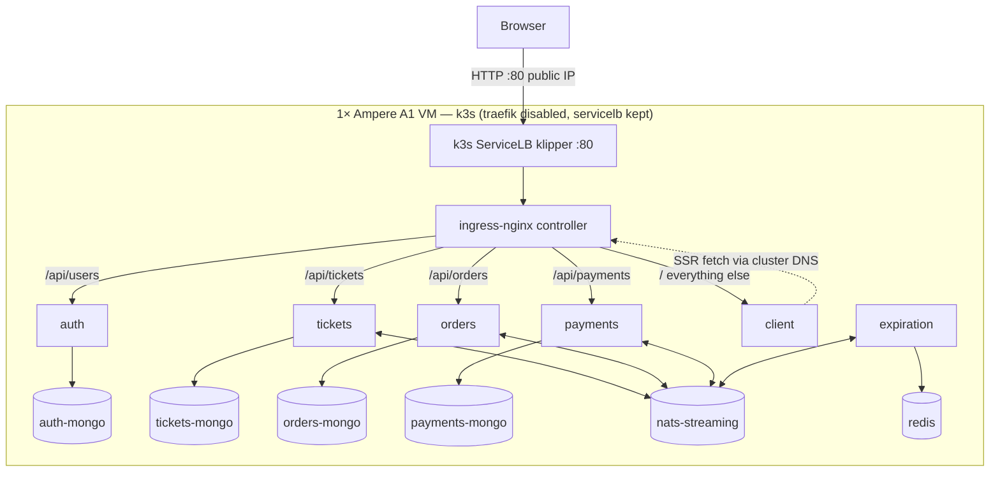

# Deploy tickethub on Oracle Cloud Always Free (ARM A1)

## Context

`tickethub` is a Kubernetes-native microservices app (the Grider ticketing app): 6 Node services
(`auth`, `tickets`, `orders`, `payments`, `expiration`, `client`/Next.js), each backed by a per-service
MongoDB, plus Redis (expiration) and NATS Streaming for events, fronted by an nginx Ingress. Today it
only runs locally via Skaffold (`infra/k8s/*`, images `toxiczeina/*`, `push: false`, dev-mode containers).

Goal: run it on a single **Oracle Always Free ARM Ampere A1** VM (4 OCPU / 24 GB, aarch64 — the instance
your `~/tickethub-launch-retry.sh` is claiming), reachable over **HTTP at the public IP**. Because the repo
is already all k8s manifests, the lowest-friction host is **k3s** (single node) — we reuse `infra/k8s/*`
almost verbatim. Verified: `nats-streaming:0.17.0`, `mongo`, `redis`, `node:alpine` all ship arm64, so no
base-image blockers.

### Image workflow — answering "what if I make changes?"
**Recommendation: build on the VM and import into k3s.** For a single aarch64 box that you iterate on, this
is better than Docker Hub because: (1) you build *natively* on arm64, avoiding `buildx`/QEMU cross-builds
from your (amd64) laptop; (2) redeploy is one script — `git pull` → `docker build` the changed service →
import into k3s → `kubectl rollout restart` — with no registry creds, push, or pull latency. Docker Hub
only wins once you have multiple nodes or CI-built images; noted as the future alternative.

## Deployment topology



## Repo changes (committed to a new branch)

1. **`infra/k8s/ingress-srv.yaml` — drop the host so the raw IP matches.**
   Remove the `- host: tickethub.com` line and re-indent the `http:`/`paths:` block up one level so the
   rules apply to *any* Host header (so `http://<public-ip>/` works). Keep `ingressClassName: nginx` and
   the `nginx.ingress.kubernetes.io/use-regex: 'true'` annotation. (The client's SSR base URL,
   `http://ingress-nginx-controller.ingress-nginx.svc.cluster.local` in `client/api/build-client.js`, is
   already correct for ingress-nginx in the `ingress-nginx` namespace — no change.)

2. **Add `imagePullPolicy: IfNotPresent`** to the app container in each of the 6 service deployments
   (`auth-depl.yaml`, `tickets-depl.yaml`, `orders-depl.yaml`, `payments-depl.yaml`, `expiration-depl.yaml`,
   `client-depl.yaml`). The `toxiczeina/*:latest` images would otherwise default to `Always` pull and fail
   with no registry; `IfNotPresent` makes k3s use the locally-imported image.

3. **`client/next.config.mjs` — allow the public IP as a dev origin.** Next 15 dev blocks cross-origin
   requests; add the instance public IP (and/or `'*'`) to the existing `allowedDevOrigins` array next to
   `'tickethub.com'`, so the Next dev server serves assets for `http://<ip>`.

4. **New `deploy/oracle/` directory** with the ops scripts + doc below. (`*-secret.yaml` is already
   gitignored, so secrets are created on the box, never committed.)

### `deploy/oracle/setup-server.sh` (run once on the VM)
```bash
#!/usr/bin/env bash
set -euo pipefail
# 1. Open Ubuntu host firewall (Oracle images ship locked to :22 only)
sudo iptables -I INPUT 6 -p tcp --dport 80  -j ACCEPT
sudo iptables -I INPUT 6 -p tcp --dport 443 -j ACCEPT
sudo netfilter-persistent save           # persists to /etc/iptables/rules.v4
# 2. k3s — disable bundled Traefik (we use ingress-nginx), keep ServiceLB (klipper)
curl -sfL https://get.k3s.io | INSTALL_K3S_EXEC="--disable traefik" sh -
mkdir -p ~/.kube && sudo cp /etc/rancher/k3s/k3s.yaml ~/.kube/config && sudo chown "$USER" ~/.kube/config
export KUBECONFIG=~/.kube/config
# 3. Docker, used only to build images (k3s itself runs containerd)
sudo apt-get update && sudo apt-get install -y docker.io && sudo usermod -aG docker "$USER"
# 4. ingress-nginx (its LoadBalancer Service makes klipper bind host :80/:443)
kubectl apply -f https://raw.githubusercontent.com/kubernetes/ingress-nginx/main/deploy/static/provider/cloud/deploy.yaml
```

### `deploy/oracle/redeploy.sh [service ...]` (build + ship changes)
```bash
#!/usr/bin/env bash
set -euo pipefail
SERVICES=("${@:-auth tickets orders payments expiration client}")
for s in ${SERVICES[@]}; do
  docker build -t "toxiczeina/$s:latest" "./$s"
  docker save "toxiczeina/$s:latest" | sudo k3s ctr -n k8s.io images import -
  kubectl rollout restart "deployment/$s-depl" 2>/dev/null || true   # no-op on first deploy
done
```
First run order on the VM: `setup-server.sh` → create secrets (below) → `redeploy.sh` (builds all) →
`kubectl apply -f infra/k8s/` → pods come up using the imported images.

### `deploy/oracle/README.md`
Document the two manual, out-of-band steps that can't be scripted from inside the VM:
- **OCI Console → VCN → Subnet → Security List (or the instance NSG):** add an **Ingress rule** allowing
  `0.0.0.0/0` TCP **80** (and 443 if wanted). Without this the cloud firewall drops traffic before it
  reaches the host.
- **Secrets** (run on the VM, values not committed):
  ```bash
  kubectl create secret generic jwt-secret    --from-literal=JWT_KEY=<random-string>
  kubectl create secret generic stripe-secret --from-literal=STRIPE_KEY=<sk_test_...> \
                                               --from-literal=STRIPE_PUBLISHABLE_KEY=<pk_test_...>
  ```
  (`stripe-secret` needs both keys: `payments-depl` reads `STRIPE_KEY`, `client-depl` reads
  `STRIPE_PUBLISHABLE_KEY`.)

## Order of operations (end to end)
1. Instance claimed (Ubuntu 22.04 ARM image) → note its public IP.
2. OCI Security List: open ingress TCP 80.
3. `git clone` this branch on the VM.
4. Set the public IP in `client/next.config.mjs` `allowedDevOrigins` (or commit a placeholder + sed it).
5. `bash deploy/oracle/setup-server.sh` (re-login once for the docker group).
6. Create the two secrets.
7. `bash deploy/oracle/redeploy.sh` to build & import all 6 images.
8. `kubectl apply -f infra/k8s/`.

## Verification
- `kubectl get pods` → all 13 pods `Running` (6 svc + 4 mongo + redis + nats + nginx in `ingress-nginx` ns).
- `kubectl get svc -n ingress-nginx ingress-nginx-controller` → `EXTERNAL-IP` shows the node IP, ports
  80/443 (klipper bound).
- On the VM: `curl -s localhost/api/users/currentuser` → JSON `{"currentUser":null}` (auth reachable
  through the ingress).
- From your laptop: `curl -I http://<public-ip>/` → 200, and open `http://<public-ip>/` in a browser →
  client renders; sign up, create a ticket, place an order, pay with a Stripe test card; confirm the
  order auto-expires after the 30s `EXPIRATION_WINDOW_SECONDS` window.
- If browser shows blocked cross-origin/asset errors, confirm the public IP is in `allowedDevOrigins` and
  `kubectl rollout restart deployment/client-depl`.

## Notes / risks
- Containers stay in **dev mode** (`ts-node-dev`, `next dev`) to match current behavior and minimize
  change; comfortably fits 24 GB. Productionizing the Dockerfiles is a possible later step, out of scope.
- `nats-streaming` is EOL but the pinned `0.17.0` has an arm64 image and works; left unchanged.
- Reboot resilience: k3s + iptables rules persist; the `caffeinate` retry script is only needed until the
  instance is claimed and isn't part of the running deployment.
